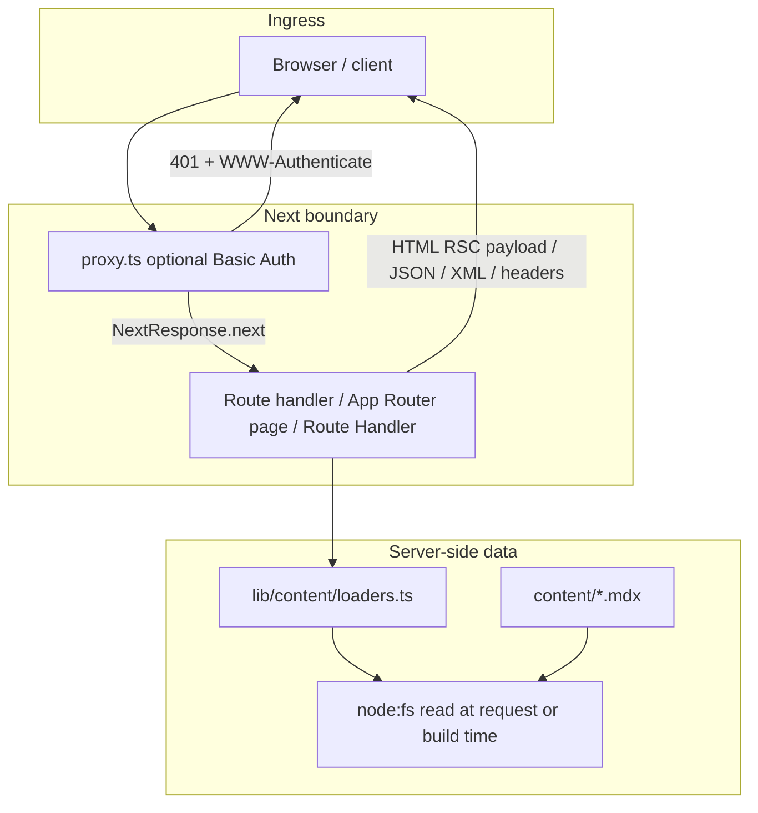
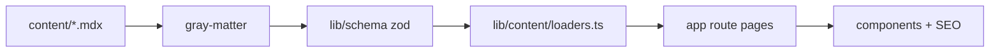

# Rakshan Hegde — Personal Website

Production-oriented personal site: **Next.js App Router**, **TypeScript (strict)**, **Tailwind CSS**, **Framer Motion**, **MDX** content in-repo. Deployed on **Vercel**; DNS often fronted by **Cloudflare**.

## Single source of truth

**This `README.md` is canonical** for stack, request flow, entry/exit points, directory map, rendering model, content rules, env vars, security baseline, CI, and “where to change what.”

Other files under `docs/` are **narrow runbooks** (deploy steps, checklists). They link back here and do not duplicate architecture—if something disagrees, **trust this README** and fix the doc.

**For LLMs / tools:** ingest this file first when mapping the codebase.

---

## Design goals

- Server Components by default for lean client bundles.
- Git-based MDX with strict runtime validation (zod).
- Search/filter only where needed (client islands).
- Production-oriented SEO, security headers, optional analytics, and CI gates.

---

## Stack (pinned intent)

| Layer                | Choice                                                                   |
| -------------------- | ------------------------------------------------------------------------ |
| Framework            | Next.js **16** App Router (`next` 16.x)                                  |
| Language             | TypeScript strict                                                        |
| Styling              | Tailwind v4, design tokens in CSS variables (Tokyo Night Storm–inspired) |
| Motion               | Framer Motion, `prefers-reduced-motion` aware                            |
| Content              | Git-tracked MDX under `content/`                                         |
| Parsing / validation | `gray-matter` + **zod** schemas in `lib/schema/`                         |
| MDX render           | `next-mdx-remote` on detail pages (`components/MdxContent.tsx`)          |
| Analytics            | `@vercel/analytics`, gated by env                                        |
| Tests                | Vitest + Testing Library; Playwright e2e smoke                           |
| Git hooks            | Husky (`prepare` in `package.json`)                                      |

Node: **≥ 20.10** (`package.json` `engines`). Package manager: **pnpm** (see CI).

---

## Request flow (high level)

Every incoming request hits **Next.js** first. The root **`proxy.ts`** (Next.js 16+ successor to `middleware.ts`) runs **only** for paths matched by its `config.matcher`; static framework assets are excluded.

**Order of operations (conceptual):**

1. **`proxy.ts`** — If `SITE_PASSWORD` is set, require HTTP Basic Auth; otherwise `NextResponse.next()`. Matcher skips `/_next/*` and `/favicon.ico`.
2. **`next.config.ts` `headers()`** — Global security headers + CSP from `lib/security/headers.ts` (applies broadly via `source: "/(.*)"`).
3. **App Router** — Matched `app/**` segment renders (mostly Server Components) or invokes Route Handlers under `app/api/*` and `app/research/rss.xml/route.ts`.

---

## Entry points (where work starts)

Use this table when routing a task to the right file.

| Kind                  | Path                                       | Role                                                                                                 |
| --------------------- | ------------------------------------------ | ---------------------------------------------------------------------------------------------------- |
| **Proxy (pre-route)** | `proxy.ts`                                 | Optional site-wide Basic Auth; `SITE_USERNAME` / `SITE_PASSWORD`                                     |
| **Root layout**       | `app/layout.tsx`                           | `<html>`, fonts, global `metadata`, root JSON-LD (`Person`, `WebSite`), optional Vercel Analytics    |
| **Chrome layout**     | `app/(site)/layout.tsx`                    | `SiteHeader`, `<main>`, `SiteFooter` — route group `(site)` does **not** appear in URLs              |
| **Site config**       | `lib/config/site.ts`                       | Name, nav, social placeholders, `siteConfig.url` (from `NEXT_PUBLIC_SITE_URL` or fallback)           |
| **Next config**       | `next.config.ts`                           | Security headers attachment                                                                          |
| **Content load**      | `lib/content/loaders.ts`                   | Read `content/{projects,research,demos}/*.mdx`, parse frontmatter, zod validate, sort by `updatedAt` |
| **Schemas**           | `lib/schema/*.ts`                          | Frontmatter + contact payload shapes                                                                 |
| **SEO helpers**       | `lib/seo/metadata.ts`, `lib/seo/jsonld.ts` | Page metadata and JSON-LD builders                                                                   |
| **Contact API**       | `app/api/contact/route.ts`                 | POST handler; gated by `ENABLE_CONTACT_FORM`; zod + rate limit                                       |
| **RSS**               | `app/research/rss.xml/route.ts`            | GET → RSS XML for research entries                                                                   |
| **Sitemap**           | `app/sitemap.ts`                           | Metadata route for sitemap                                                                           |
| **Robots**            | `app/robots.ts`                            | Metadata route for robots.txt                                                                        |
| **404**               | `app/not-found.tsx`                        | Global not-found UI                                                                                  |

**Pages (all under `app/(site)/` unless noted):**

| URL                | File                              |
| ------------------ | --------------------------------- |
| `/`                | `(site)/page.tsx`                 |
| `/projects`        | `(site)/projects/page.tsx`        |
| `/projects/[slug]` | `(site)/projects/[slug]/page.tsx` |
| `/research`        | `(site)/research/page.tsx`        |
| `/research/[slug]` | `(site)/research/[slug]/page.tsx` |
| `/demos`           | `(site)/demos/page.tsx`           |
| `/demos/[slug]`    | `(site)/demos/[slug]/page.tsx`    |
| `/about`           | `(site)/about/page.tsx`           |
| `/privacy`         | `(site)/privacy/page.tsx`         |
| `/terms`           | `(site)/terms/page.tsx`           |

Detail routes use **`generateStaticParams`** where applicable so slugs are known at build time.

---

## Exit points (what leaves the app)

| Response type                       | Where                                                                          |
| ----------------------------------- | ------------------------------------------------------------------------------ |
| **HTML (RSC)**                      | App Router pages → streamed/flight response to browser                         |
| **401 + `WWW-Authenticate: Basic`** | `proxy.ts` when auth missing or invalid                                        |
| **JSON**                            | `POST /api/contact` — success/error body from `app/api/contact/route.ts`       |
| **XML (RSS)**                       | `GET /research/rss.xml`                                                        |
| **Metadata routes**                 | `GET` sitemap / robots via `app/sitemap.ts`, `app/robots.ts`                   |
| **Static assets**                   | `public/` (e.g. local demo videos), `_next/static` (bypassed by proxy matcher) |

Outbound **webhook** (optional): contact form POSTs to `CONTACT_FORM_WEBHOOK_URL` when backend form is enabled.

---

## Directory map (responsibilities)

| Directory       | Responsibility                                                               |
| --------------- | ---------------------------------------------------------------------------- |
| `app/`          | Routes, layouts, API & RSS Route Handlers, sitemap/robots                    |
| `components/`   | UI; client components for search/filter, motion, contact form, MDX overrides |
| `content/`      | Source of truth: `projects/`, `research/`, `demos/` MDX                      |
| `lib/config/`   | Site copy and nav                                                            |
| `lib/content/`  | Loaders and typed entry aliases                                              |
| `lib/schema/`   | Zod frontmatter + API schemas                                                |
| `lib/search/`   | Fuzzy filter/scoring for list pages                                          |
| `lib/seo/`      | Metadata + JSON-LD                                                           |
| `lib/security/` | CSP / security header definitions                                            |
| `lib/motion/`   | Motion timing/easing shared values                                           |
| `lib/utils/`    | Small helpers (`cn`, dates)                                                  |
| `tests/`        | Vitest unit/integration; Playwright in `tests/e2e/`                          |
| `docs/`         | Deploy runbook + checklist only (architecture is this README)                |

---

## Rendering & client boundaries

- **Default:** Server Components — data fetching via loaders in server `page.tsx` files.
- **Client Components** (examples): `*ClientView.tsx` list/search UIs, `ContactForm`, `MotionReveal` and motion-enhanced cards.
- **MDX body:** Detail pages render through `MdxContent` (`next-mdx-remote/rsc`) with `remark-gfm`, `rehype-highlight`, and internal `href` mapped to Next `Link`.

---

## Content data flow (MDX → pages)

---

## Performance

- Server rendering and static params on detail routes keep client JS small.
- Video embeds: lazy loading and bounded layout to limit CLS (`components/VideoEmbed.tsx`).
- Motion respects **`prefers-reduced-motion`**.

---

## Local setup

1. **Node** ≥ 20.10 and **pnpm** (repo assumes pnpm; CI uses pnpm 10).
2. `pnpm install` (runs Husky `prepare`).
3. `cp .env.example .env.local` and set variables as needed.
4. `pnpm dev` → [http://localhost:3000](http://localhost:3000).

### E2E / Playwright

CI: `pnpm exec playwright install --with-deps chromium`. On minimal or Arch-based systems, install OS libs if Chromium fails to start.

---

## Environment variables

Authoritative template: **`.env.example`**.

| Variable                            | Purpose                                                        |
| ----------------------------------- | -------------------------------------------------------------- |
| `NEXT_PUBLIC_SITE_URL`              | Canonical URL (`metadataBase`, sitemap, OG, JSON-LD)           |
| `NEXT_PUBLIC_ENABLE_ANALYTICS`      | `true` → Vercel `<Analytics />` in root layout                 |
| `NEXT_PUBLIC_ENABLE_CONTACT_FORM`   | Show contact UI on About                                       |
| `SITE_USERNAME`                     | Basic Auth user (default `rakshan` if unset)                   |
| `SITE_PASSWORD`                     | If set (non-empty), enables site-wide Basic Auth in `proxy.ts` |
| `ENABLE_CONTACT_FORM`               | Allow `POST /api/contact`                                      |
| `CONTACT_FORM_WEBHOOK_URL`          | Webhook for submissions                                        |
| `CONTACT_FORM_RATE_LIMIT_WINDOW_MS` | Rate-limit window (ms)                                         |
| `CONTACT_FORM_RATE_LIMIT_MAX`       | Max POSTs per IP per window                                    |

Secrets stay in **`.env.local`** (local) and **Vercel project settings** (production).

---

## Content authoring

MDX lives in:

- `content/projects/*.mdx`
- `content/research/*.mdx`
- `content/demos/*.mdx`

Pipeline: **read file** → **gray-matter** → **zod parse** (`lib/schema/*`) → **sort** by `updatedAt` desc → **detail pages** compile MDX via `next-mdx-remote`.

### Project frontmatter (required)

`slug`, `title`, `summary`, `status` (`ongoing` \| `completed`), `startedAt`, `updatedAt`, `stack[]`, `tags[]`, `aiFocus[]`.  
`completed` → require `completedAt`. Optional `featured` for homepage.

### Research frontmatter (required)

`slug`, `title`, `summary`, `updatedAt`, `tags[]`.

### Demo frontmatter (required)

`slug`, `title`, `summary`, `updatedAt`, `videoType` (`youtube` \| `vimeo` \| `local`), `videoUrl`, `tags[]`.  
`local` → use public paths like `/videos/demo.mp4`.

---

## Scripts

| Script                      | Action                                |
| --------------------------- | ------------------------------------- |
| `pnpm dev`                  | Dev server                            |
| `pnpm build` / `pnpm start` | Production build / serve              |
| `pnpm typecheck`            | `tsc --noEmit`                        |
| `pnpm lint`                 | ESLint                                |
| `pnpm format`               | Prettier                              |
| `pnpm test`                 | Vitest                                |
| `pnpm test:e2e`             | Playwright                            |
| `pnpm test:e2e:ui`          | Playwright UI                         |
| `pnpm ci`                   | typecheck → lint → test → build → e2e |

---

## CI

GitHub Actions: `.github/workflows/ci.yml`, job **`quality`** — checkout, pnpm install, typecheck, lint, vitest, build, Playwright chromium + e2e.

---

## SEO & discovery

- Per-page/metadata helpers and JSON-LD (`Article` for research; project/demo structured data on detail pages).
- `app/robots.ts`, `app/sitemap.ts`.
- RSS: `/research/rss.xml`.

---

## Security baseline

- CSP + security headers: `lib/security/headers.ts` → `next.config.ts`.
- Contact route: zod validation, env flags, in-memory IP rate limiting.
- Optional **Basic Auth** in `proxy.ts` (timing-safe credential check via SHA-256 digest comparison — Edge-safe pattern).
- No committed secrets.

---

## Deployment (summary)

1. Import repo into Vercel; set env vars.
2. Custom domain in Vercel; Cloudflare DNS → Vercel target; SSL Full (strict).
3. Smoke-test routes, sitemap/robots/RSS, headers, analytics if enabled.

Details: **`docs/deployment.md`**.

---

## Branch protection (recommended)

On `main`: require PR, require **`quality`** CI success, up-to-date branch, no force-push.

---

## Dependency rationale (short)

- **next-mdx-remote:** MDX from repo files without bundling all MDX at edge cases in the main bundle.
- **zod:** Runtime validation for content and API payloads.
- **In-repo fuzzy search:** `lib/search/fuzzy.ts` avoids pulling a heavy search dependency.

---

## Related documentation (non-canonical)

| File                           | Role                                               |
| ------------------------------ | -------------------------------------------------- |
| `docs/architecture.md`         | Pointer to this README (no duplicate architecture) |
| `docs/deployment.md`           | Step-by-step Vercel + Cloudflare + validation      |
| `docs/production-checklist.md` | Pre-ship checkbox list                             |
