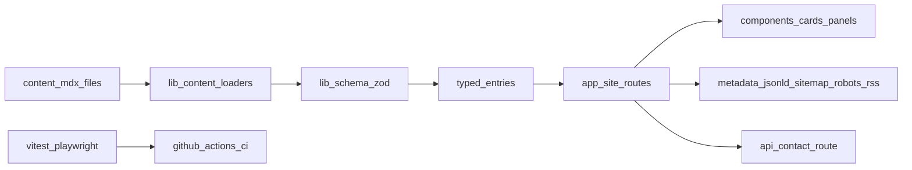

# Architecture

## High-level goals

- Server components by default for lean client bundles
- Git-based MDX content with strict runtime validation
- Search/filter interactivity only where needed (client components)
- Production-oriented SEO, security headers, analytics, and CI gates

## System map

## Directory responsibilities

- `app/`
  - Route composition, metadata, layout, sitemap/robots, RSS, and API route
- `components/`
  - Reusable UI primitives and client interactivity components
- `lib/content/`
  - Content loaders and typed entry models
- `lib/schema/`
  - zod frontmatter and API payload validation
- `lib/search/`
  - Fuzzy search scoring/filter utilities
- `lib/seo/`
  - Metadata + JSON-LD helpers
- `lib/security/`
  - Security header and CSP baseline
- `content/`
  - Projects, research, and demos MDX source of truth
- `tests/`
  - Unit/integration/e2e smoke coverage

## Rendering strategy

- **Server-first**: all route pages are server components unless interactivity is needed.
- **Client components**:
  - Search/filter bars and list views
  - Motion-enhanced cards/panels
  - Contact form
- **Static generation**:
  - Content detail routes use `generateStaticParams` for stable pages.

## Content pipeline

1. Read MDX files from `content/<collection>`.
2. Parse frontmatter with `gray-matter`.
3. Validate/normalize with zod schemas.
4. Sort by `updatedAt` descending.
5. Render body on detail routes via `next-mdx-remote`.

## Performance notes

- Route-level server rendering and pre-rendering minimize client JS.
- Video embeds use `loading="lazy"` and bounded containers to reduce CLS.
- Motion respects `prefers-reduced-motion`.

## Security notes

- Global secure headers + CSP configured in Next config.
- Contact API is env-flagged, validated, and rate-limited.
- No credentials or tokens are stored in repository.
